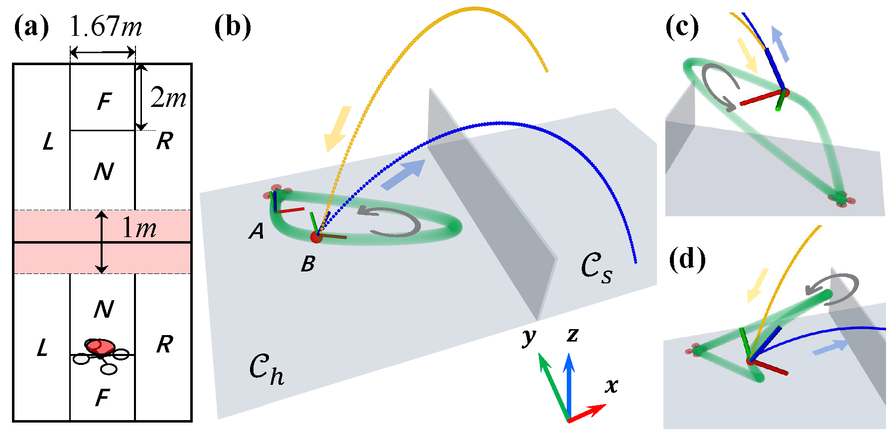

# Attachment 

The attachment contains following parts to support and complement the experimental results and analysis mentioned in our paper ''Bat Planner: Aggressive Flying Ball Player''. These contents provide visual representation of the performance of our method and the comparison algorithms.

- Trjectory of the real-world experiments
- Trjectory of the simulations
- Success rate of the real-world experiments
- Failure analysis in real-world experiments

Simulation data for 36 scenarios, with 1000 trials per scenario using Bat, Bat-Lite and Juggle, has been uploaded. These data include serve position (random), serve velocity (random), landing position (if the ball was not catched by the quadrotor), quadrotor's hitting position, hitting velocity and hitting attitude (quaternion). 

  
   
  <em>Fig. 1 Simulation Scene</em>

The file naming convention is as follows:

- 1\2\3\4 represent N\F\L\R regions as shown in Fig. 1.

- *p* is short for *''proposed''* (Bat), *l* is short for *''lite''* (Bat-Lite), *b* is short for *''benchmark''* (Juggle).

- The files are named as ''Serve region _ Land region _ Target region _ Method''. For example, ''1_2_3_b.csv'' means the ball is served in N-region of  *$C_s$* and will land in F-region of *$C_h$* if without hit. The target is set in the center of L-region of *$C_s$*.

# Code
On the way...

